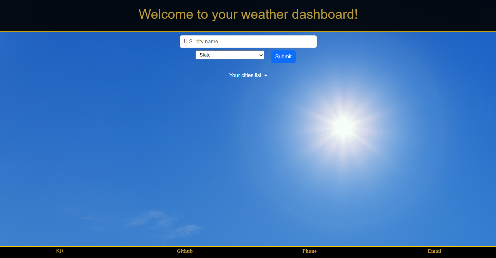
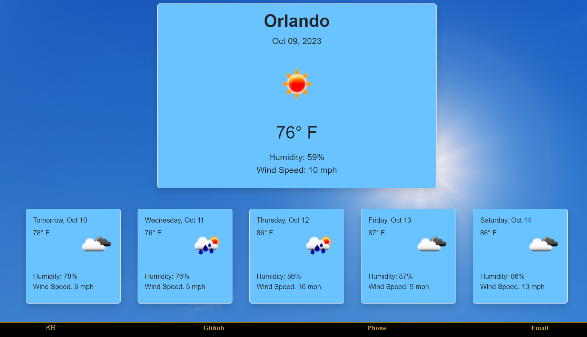
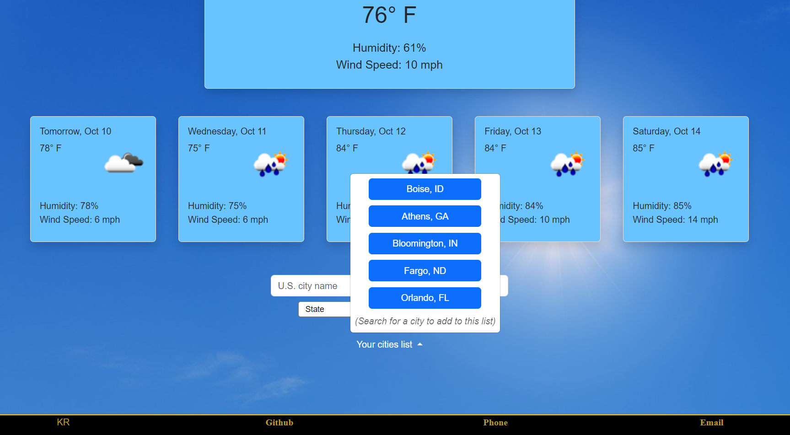

# Weather-dashboard
Simple weather site using [open weather API](www.openweathermap.org)

## Description
A simple, lightweight site to get the current and five-day forecast for any city in the United States! Results are stored between sessions so you can quickly find up-to-date weather information about any city you have looked up previously.

Our interface is designed to be simple and visually appealing, utilizing UCF's 

## Installation

No installation is necessary! Follow the following links to the github repository and live site.

[Github repository](https://github.com/kurtriecken/Weather-dashboard)

[Deployed site](https://kurtriecken.github.io/Weather-dashboard/)

## Usage 

**Page Opening**

Upon initial load of the site, you are greeted with a form to search for a city's weather information. Simply type your city into the search bar and select the state or U.S. territory from the dropdown menu, then click on the Submit button. If you have been to our site before and seen weather data, you may choose any of your previously selected cities from the dropdown titled "Your cities list". If this is your first time, don't worry! This dropdown will include your saved cities as soon as you start your search.

**Weather data display**

After using our search function, a successful return will look like this! The largest icon at the top includes the city name, today's date, an icon depicting the weather, as well as the temperature, humidity, and wind speed. The next five icons give you all of this same information (except the city name) for your five-day forecast. Units are imperial (U.S. standard).

**City dropdown list**

At any time, you may select from the dropdown list of previously searched cities. Clicking any of these buttons that appear will repopulate the page with current information about that city's weather! City and state are recorded and displayed so you can differentiate between like-named cities in different states (i.e. Bloomington, IN vs. Bloomington, IL). Also, city searches are saved between sessions so there is no need to worry if you accidentally close the browser.

Finally, contact information for myself (Kurt Riecken) is at the bottom of the page. This includes links to my personal GitHub, phone number, and email address.

If the site does not function on your device or if you have any questions, please feel free to contact me here on GitHub.

## Credits

Written by [kurtriecken](github.com/kurtriecken)

State abbreviations list from GitHub user [bubblerun](https://gist.github.com/bubblerun/a624de5b4fa8ff0980010054a7220977)

## License

MIT license